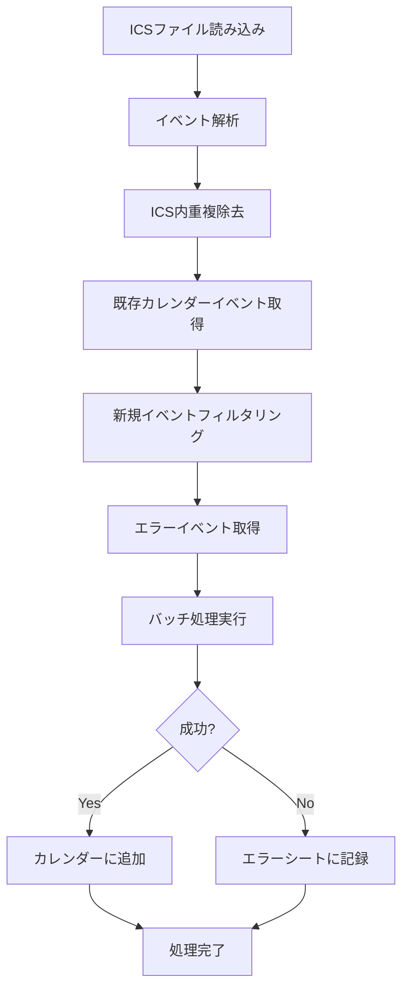

# ICS to Google Calendar Importer (GAS)
Google Apps Script (GAS) を使用して、ICSファイルからGoogleカレンダーにイベントを自動インポートするツールです。

## 時間がない人のまとめ
Googleカレンダーは過去の予定は1年前まで遡って同期する。
つまり、スマホを機種変更した場合は1年以上前は同期されずにスマホからは見られない。

スマホで見られるようにするには、ウェブからGoogleカレンダーにアクセスしてエクスポート→インポートする必要がある。
こうすることで既存の予定の作成日がインポートした日にちに上書きされ、1年以内の更新となり、スマホにも表示される。

しかし、インポートするデータは1MB以下であるため、現時点ではデータ量がそれ以上ありインポートできなかった。

GASのスクリプトを作成したので、こちらを使う。
APIのレートリミットに引っかかってエラーになる場合があるが、エラーになった処理はスプレッドシートに記録されるため、しばらくして再実行するとエラーになって登録できなかった予定も登録してくれる。

### 簡単な利用方法
1. Googleドライブにエクスポートしたファイルをアップロード
2. ICS_FILE_ID（Googleドライブ上のファイルのURLのIDみたいな部分）とCALENDAR_ID（アカウントのメアド）を設定
3. GASでimportIcsToCalendar()を実行

---

## 概要

このツールは以下の機能を提供します：

- **ICSファイル解析**: Googleドライブ上のICSファイルを読み込み、イベント情報を抽出
- **重複除去**: ICSファイル内およびカレンダー内の重複イベントを自動検出・除去
- **バッチ処理**: 大量のイベントを効率的に処理するためのバッチ処理機能
- **エラーハンドリング**: 処理に失敗したイベントを記録し、再試行可能
- **統計・監視**: 処理状況の詳細な統計情報とログ出力

## 主な特徴

### 🔄 重複防止機能
- ICSファイル内の重複イベント除去
- 既存カレンダーイベントとの重複チェック
- 同日・同タイトルのイベントを自動識別

### ⚡ 高性能処理
- バッチ処理による効率的なAPI利用
- レート制限対応のスリープ機能
- 大量データの段階的処理

### 🛡️ 堅牢なエラー処理
- 失敗したイベントの自動記録
- エラー詳細のスプレッドシート保存
- 再実行時の自動リトライ機能

### 📊 詳細な監視機能
- 処理状況のリアルタイムログ
- 統計情報の自動生成
- デバッグ用の各種確認関数

## セットアップ

### 1. Google Apps Script プロジェクトの作成

1. [Google Apps Script](https://script.google.com/) にアクセス
2. 「新しいプロジェクト」を作成
3. 提供されたコードを貼り付け

### 2. 設定の変更

`CONFIG` オブジェクトの値を環境に合わせて変更してください：

```javascript
const CONFIG = {
  ICS_FILE_ID: 'YOUR_ICS_FILE_ID',        // GoogleドライブのICSファイルID
  CALENDAR_ID: 'your-email@gmail.com',    // 対象カレンダーのID
  ERROR_SHEET_NAME: 'ICS_Import_Errors',  // エラー記録シート名
  BATCH_SIZE: 10,                         // バッチサイズ（推奨: 5-20）
  SLEEP_INTERVAL: 1000                    // API呼び出し間隔（ミリ秒）
};
```

#### 設定項目の詳細

| 項目 | 説明 | 取得方法 |
|------|------|----------|
| `ICS_FILE_ID` | GoogleドライブのICSファイルID | ファイルのURLから抽出: `https://drive.google.com/file/d/FILE_ID/view` |
| `CALENDAR_ID` | インポート先カレンダーID | カレンダー設定 → 「カレンダーの統合」→ カレンダーID |
| `ERROR_SHEET_NAME` | エラー記録用スプレッドシート名 | 任意の名前（自動作成されます） |
| `BATCH_SIZE` | 一度に処理するイベント数 | 5-20を推奨（大きすぎるとタイムアウト） |
| `SLEEP_INTERVAL` | API呼び出し間隔 | 1000ms推奨（レート制限対策） |

### 3. 権限の設定

初回実行時に以下の権限が要求されます：
- Google Drive API（ICSファイル読み込み）
- Google Calendar API（イベント作成・取得）
- Google Sheets API（エラー記録）

## 利用方法

### 基本的な使用手順

#### 1. 設定確認
```javascript
checkConfiguration()
```
設定が正しく行われているかを確認します。

#### 2. 統計情報の確認
```javascript
showStatistics()
```
処理対象のイベント数や推定処理時間を確認します。

#### 3. テスト実行（推奨）
```javascript
testImport()
```
少数のイベント（5件）でテスト実行を行います。

#### 4. 本実行
```javascript
importIcsToCalendar()
```
全てのイベントをインポートします。

### 主要な関数

| 関数名 | 用途 | 説明 |
|--------|------|------|
| `importIcsToCalendar()` | メイン実行 | ICSファイルからカレンダーへの完全インポート |
| `testImport()` | テスト実行 | 少数イベントでの動作確認 |
| `showStatistics()` | 統計表示 | 処理対象数や推定時間の確認 |
| `checkConfiguration()` | 設定確認 | ファイル・カレンダーアクセスの確認 |
| `checkErrorSheet()` | エラー確認 | 前回のエラー内容を確認 |
| `clearErrorSheet()` | エラークリア | エラー記録をクリア |

### デバッグ・確認用関数

```javascript
// ICSファイルの内容確認
checkIcsFileContent()

// 特定期間のカレンダーイベント確認
checkEventsInDateRange('2024-01-01', '2024-01-31')

// エラーシートの内容確認
checkErrorSheet()
```

## 処理フロー



## エラー処理

### 自動エラー記録
処理に失敗したイベントは自動的にスプレッドシートに記録されます：

| 列 | 内容 |
|----|------|
| Title | イベントタイトル |
| Start Date | 開始日時 |
| End Date | 終了日時 |
| Is All Day | 終日イベントフラグ |
| Description | 説明 |
| Location | 場所 |
| Error Message | エラー詳細 |

### 再試行機能
- 再実行時、前回のエラーイベントが自動的に再試行されます
- エラーシートは処理開始時にクリアされます
- 成功したイベントはエラーシートから除去されます

## パフォーマンス最適化

### バッチサイズの調整
```javascript
CONFIG.BATCH_SIZE = 10; // 推奨値: 5-20
```
- 小さすぎる: 処理時間が長くなる
- 大きすぎる: タイムアウトリスクが増加

### スリープ間隔の調整
```javascript
CONFIG.SLEEP_INTERVAL = 1000; // 推奨値: 500-2000ms
```
- Google Calendar APIのレート制限対策
- 安定した処理のため適切な間隔を設定

## トラブルシューティング

### よくある問題と解決方法

#### 1. ファイルアクセスエラー
```
❌ ICSファイルアクセスエラー: File not found
```
**解決方法**:
- ICSファイルIDが正しいか確認
- ファイルの共有設定を確認

#### 2. カレンダーアクセスエラー
```
❌ カレンダーアクセスエラー: Calendar not found
```
**解決方法**:
- カレンダーIDが正しいか確認
- カレンダーの共有設定を確認

#### 3. タイムアウトエラー
```
❌ 作成エラー: Timeout
```
**解決方法**:
- `BATCH_SIZE`を小さくする（5-10）
- `SLEEP_INTERVAL`を大きくする（1500-2000ms）

#### 4. 重複イベントの大量作成
**解決方法**:
- 重複チェック機能が正常に動作しているか確認
- テスト実行で動作を確認してから本実行

### ログの確認方法

1. Google Apps Script エディタで「実行」→「実行の開始」
2. 「表示」→「ログ」でログを確認
3. エラーの詳細は `checkErrorSheet()` で確認

## 制限事項

### Google Apps Script の制限
- **実行時間**: 最大6分（大量データは分割実行推奨）
- **API呼び出し**: 1日あたりの制限あり
- **メモリ**: 大量データ処理時は注意

### ICSファイル対応
- **対応形式**: RFC 5545準拠のICSファイル
- **文字エンコーディング**: UTF-8推奨
- **ファイルサイズ**: 数MB程度まで

### カレンダー制限
- **イベント数**: カレンダーあたりの制限あり
- **重複判定**: 同日・同タイトルベース（完全一致ではない）

## ライセンス

このコードはMITライセンスの下で提供されています。

## サポート

問題が発生した場合：
1. `checkConfiguration()` で設定を確認
2. `testImport()` で小規模テストを実行
3. ログとエラーシートで詳細を確認
4. 必要に応じてバッチサイズやスリープ間隔を調整

---

**注意**: 本番環境での使用前に、必ずテストカレンダーでの動作確認を行ってください。